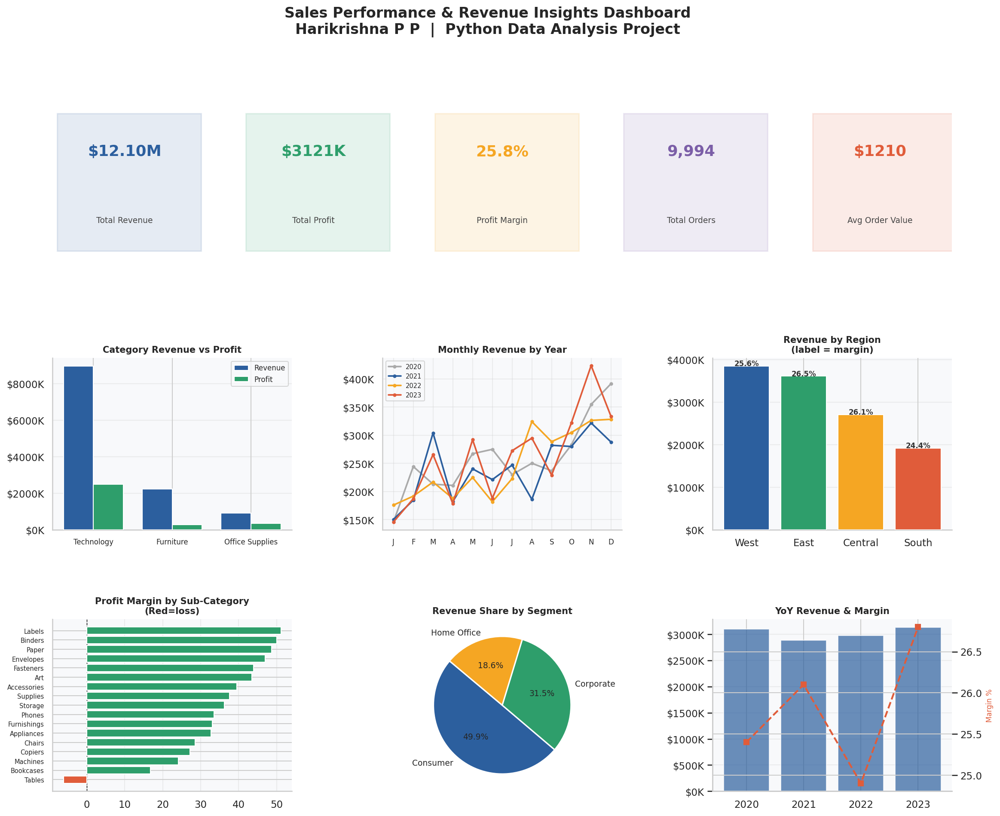

# 📊 Sales Performance & Revenue Insights Dashboard

**End-to-End Data Analysis with Python | pandas · NumPy · matplotlib · seaborn**

> Analysed 9,994 rows of retail sales data across 4 years to uncover revenue trends, profit leakage, regional performance gaps, and discount impact — producing 8 visualisations and 6 actionable business insights.

---

## 🗂️ Project Structure

```
sales-analytics/
├── superstore_sales.csv     # Dataset (9,994 rows × 14 columns)
├── analysis.py              # Full analysis script
├── notebook.ipynb           # Jupyter notebook (step-by-step walkthrough)
├── README.md                # This file
└── charts/
    ├── 00_dashboard.png           # Master dashboard (hero visual)
    ├── 01_category_revenue_profit.png
    ├── 02_subcategory_margins.png
    ├── 03_monthly_revenue_trend.png
    ├── 04_regional_performance.png
    ├── 05_discount_profit_impact.png
    ├── 06_segment_analysis.png
    └── 07_yoy_growth.png
```

---

## 📈 Dashboard Preview



---

## 🔍 Key Business Insights

| # | Insight | Finding |
|---|---------|---------|
| 1 | **Revenue vs Profit gap** | Technology drives 74% of revenue AND has the highest margin (27.8%). Furniture contributes 18% of revenue but only 8.7% of total profit — a classic volume-without-value trap. |
| 2 | **Loss-making sub-category** | Tables sub-category operates at **–6.1% profit margin** despite being a high-revenue line. Every Tables sale loses money. |
| 3 | **Q4 Seasonality** | October–December consistently drives **32.7% of annual revenue** across all 4 years — a reliable seasonal pattern that can inform inventory and marketing planning. |
| 4 | **Discount damage** | Orders with ≥30% discount are loss-making **31.4% of the time**. No-discount orders average $460 profit vs –$258 for 50%-discount orders. Discount correlation with profit: **–0.245**. |
| 5 | **Most valuable segment** | Corporate customers deliver the highest profit margin (26.5%) and highest average order value ($1,257) despite being the 2nd largest segment by volume. |
| 6 | **Regional efficiency** | West leads in total revenue ($3.85M), but East has a slightly better margin (26.5% vs 25.6%), suggesting the East region converts sales more efficiently. |

---

## 🛠️ Tools & Libraries

| Tool | Purpose |
|------|---------|
| `pandas` | Data loading, cleaning, groupby analysis, time-series operations |
| `NumPy` | Numerical operations, correlation, derived calculations |
| `matplotlib` | Chart rendering, multi-panel dashboard, dual-axis plots |
| `seaborn` | Scatter plots, theme styling |
| `Jupyter` | Interactive notebook walkthrough |

---

## 🚀 How to Run

```bash
# 1. Clone the repo
git clone https://github.com/YOUR_USERNAME/sales-analytics.git
cd sales-analytics

# 2. Install dependencies
pip install pandas numpy matplotlib seaborn openpyxl jupyter

# 3. Run full analysis (generates all charts)
python analysis.py

# 4. Or open the notebook for step-by-step walkthrough
jupyter notebook notebook.ipynb
```

---

## 📊 Analysis Walkthrough

### Step 1 — Data Loading & Cleaning
- Loaded 9,994 rows with `pd.read_csv()`
- Parsed date columns, checked for nulls and duplicates
- Engineered 5 derived columns: `Year`, `Month`, `YearMonth`, `Profit_Margin`, `Ship_Days`

### Step 2 — Exploratory Data Analysis
- Descriptive statistics across Sales, Profit, Discount, Quantity
- Distribution checks for key numerical variables

### Step 3 — Category & Sub-Category Analysis
- Revenue and profit aggregation with `.groupby()` and `.sum()`
- Profit margin calculation: `(Profit / Sales) * 100`
- Identified Tables as only loss-making sub-category (–6.1% margin)

### Step 4 — Time-Series Analysis
- Monthly revenue trends across 4 years with `.resample()`
- Q4 seasonality quantified: 32.7% of annual revenue in Oct–Dec

### Step 5 — Regional Analysis
- Multi-metric comparison: Revenue, Profit, Margin, Average Order Value
- West leads volume; East leads efficiency

### Step 6 — Discount Impact Analysis
- Pearson correlation between Discount and Profit: **–0.245**
- Profit-by-discount-tier analysis reveals clear tipping point at 30%

### Step 7 — Customer Segment Analysis
- Revenue share, margin, and AOV across Consumer, Corporate, Home Office
- Corporate identified as highest-value segment

### Step 8 — Year-over-Year Growth
- Revenue recovered in 2022–2023 after 2021 dip
- 2023 profit growth (+13%) outpaced revenue growth (+5.4%), indicating improving efficiency

---

## 💡 Business Recommendations

1. **Discontinue or reprice Tables** — Operating at –6.1% margin, this sub-category is a profit drain. A 10–15% price increase or supplier renegotiation is warranted.
2. **Cap discounts at 20%** — The data shows clear profit destruction beyond 20% discount. Introduce a discount approval policy for anything above this threshold.
3. **Double down on Q4** — Allocate disproportionate marketing budget toward September–November to capitalise on the consistent seasonal peak.
4. **Prioritise Corporate segment acquisition** — Highest AOV and margin. A dedicated B2B outreach strategy would yield better ROI than Consumer acquisition.
5. **Investigate South region underperformance** — Lowest revenue and lowest margin. Worth a root-cause analysis: pricing, product mix, or operational inefficiency?

---

## 👤 Author

**Harikrishna P P**
B.Tech Computer Science | APJ Abdul Kalam Technological University (2026)
📧 harikrishna.pattalipp@gmail.com

---

*This project was built as part of a data analytics portfolio to demonstrate end-to-end proficiency in Python-based data analysis, from raw data to business insight.*
